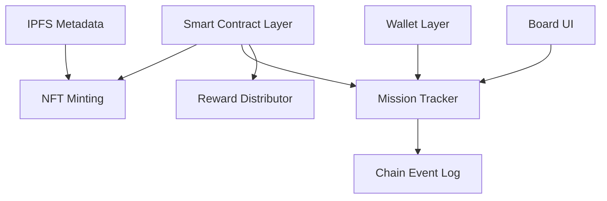

# MeeChain NFT Mission System (MCB)

A modular blockchain-based NFT mission system built on Ethereum, featuring card collection mechanics, mission tracking, and automated reward distribution with IPFS metadata integration.

## 🏗️ Architecture

The system follows a modular architecture as specified:



## 📦 Core Components

### 1. MeeChainNFT Contract
- **Purpose**: ERC721-based NFT contract for mission cards
- **Features**:
  - Mint NFTs with IPFS metadata URIs
  - Track mission IDs associated with each card
  - Update metadata URIs (for dynamic content)
  - Query all tokens owned by a wallet
- **Events**: `NFTMinted`, `MetadataUpdated`

### 2. MissionTracker Contract
- **Purpose**: Manages missions and validates card ownership
- **Features**:
  - Create and manage missions with requirements
  - Verify wallet has required cards for missions
  - Track mission completion status
  - Support for mission activation/deactivation
- **Events**: `MissionCreated`, `MissionCompleted`, `MissionUpdated`

### 3. RewardDistributor Contract
- **Purpose**: Distributes rewards upon mission completion
- **Features**:
  - Create rewards (NFT, Content Unlock, or Both)
  - Automatic reward distribution on mission completion
  - Prevent duplicate reward claims
  - Support for triggering rewards manually or via events
- **Events**: `RewardCreated`, `RewardClaimed`, `NFTRewardMinted`, `ContentUnlocked`

## 🚀 Getting Started

### Prerequisites
- Node.js >= 16.0.0
- npm or yarn

### Installation

```bash
# Clone the repository
git clone https://github.com/MeeChain-v1/MCB.git
cd MCB

# Install dependencies
npm install
```

### Compile Contracts

```bash
npm run compile
```

### Run Tests

```bash
npm test
```

### Deploy

```bash
npx hardhat run scripts/deploy.js --network <network-name>
```

## 📋 Contract Specifications

### MeeChainNFT

#### Functions
- `mintCard(address to, string memory ipfsURI, uint256 missionId)`: Mint new NFT card
- `updateTokenURI(uint256 tokenId, string memory newTokenURI)`: Update NFT metadata
- `tokensOfOwner(address owner)`: Get all token IDs owned by address

### MissionTracker

#### Functions
- `createMission(uint256 missionId, string memory name, uint256[] memory requiredCardIds, uint256 rewardAmount)`: Create new mission
- `hasRequiredCards(address wallet, uint256 missionId)`: Check if wallet meets mission requirements
- `completeMission(uint256 missionId)`: Complete a mission (requires all cards)
- `updateMissionStatus(uint256 missionId, bool isActive)`: Activate/deactivate mission

### RewardDistributor

#### Reward Types
- `NFT` (0): Mint new NFT as reward
- `UNLOCK_CONTENT` (1): Emit event to unlock content
- `BOTH` (2): Both NFT mint and content unlock

#### Functions
- `createReward(uint256 rewardId, RewardType rewardType, string memory ipfsURI, uint256 missionId)`: Create reward
- `claimReward(uint256 rewardId)`: Claim reward (user-initiated)
- `triggerReward(address user, uint256 missionId, uint256 rewardId)`: Trigger reward (admin)

## 🔄 Mission Flow

1. **Card Minting**: Admin mints NFT cards with IPFS metadata to users
2. **Card Collection**: Users collect cards from various missions
3. **Mission Check**: System verifies wallet has required cards
4. **Mission Completion**: User completes mission when requirements are met
5. **Reward Distribution**: System automatically triggers reward
6. **Content Unlock**: User receives NFT rewards or unlocked content

## 🎯 Use Cases

### Example 1: Simple Card Collection Mission
```javascript
// 1. Create mission requiring 3 specific cards
await missionTracker.createMission(
  1,                    // missionId
  "Starter Mission",    // name
  [1, 2, 3],           // required card mission IDs
  100                   // reward amount
);

// 2. Mint cards to user
await nftContract.mintCard(userAddress, "ipfs://card1", 1);
await nftContract.mintCard(userAddress, "ipfs://card2", 2);
await nftContract.mintCard(userAddress, "ipfs://card3", 3);

// 3. User completes mission
await missionTracker.connect(user).completeMission(1);

// 4. User claims reward
await rewardDistributor.createReward(1, 0, "ipfs://legendary", 1);
await rewardDistributor.connect(user).claimReward(1);
```

### Example 2: Content Unlock Mission
```javascript
// Create content unlock reward
await rewardDistributor.createReward(
  2,                          // rewardId
  1,                          // UNLOCK_CONTENT type
  "ipfs://secret-content",    // content URI
  missionId
);

// When user claims, ContentUnlocked event is emitted
// Frontend listens for this event to display content
```

## 🔐 Security Features

- **Access Control**: Owner-only functions for minting and mission creation
- **Duplicate Prevention**: Cannot claim same reward twice
- **Validation**: Must complete mission before claiming rewards
- **Event Logging**: All major actions emit events for transparency

## 📊 Testing

The project includes comprehensive tests covering:
- NFT minting and metadata management
- Mission creation and validation
- Card ownership verification
- Reward distribution (all types)
- Complete end-to-end mission flows

Run tests:
```bash
npx hardhat test
```

## 🛠️ Development

### Project Structure
```
MCB/
├── contracts/
│   ├── MeeChainNFT.sol          # NFT contract with IPFS support
│   ├── MissionTracker.sol       # Mission management
│   └── RewardDistributor.sol    # Reward distribution
├── test/
│   └── MissionSystem.test.js    # Comprehensive tests
├── scripts/
│   └── deploy.js                # Deployment script
├── hardhat.config.js            # Hardhat configuration
└── package.json
```

### Adding New Features

To extend the system:

1. **New Mission Types**: Modify `MissionTracker.sol` to add custom validation logic
2. **New Reward Types**: Extend the `RewardType` enum in `RewardDistributor.sol`
3. **Metadata Standards**: Follow ERC721 metadata standards for IPFS content

## 🌐 IPFS Integration

### Metadata Structure
NFT metadata should follow this structure:

```json
{
  "name": "MeeChain Card #1",
  "description": "Starter mission card",
  "image": "ipfs://QmImageHash",
  "attributes": [
    {
      "trait_type": "Mission",
      "value": "Starter"
    },
    {
      "trait_type": "Rarity",
      "value": "Common"
    }
  ]
}
```

Upload to IPFS and use the resulting hash (e.g., `ipfs://QmHash`) when minting cards.

## 📝 License

MIT

## 🤝 Contributing

Contributions are welcome! Please follow these steps:

1. Fork the repository
2. Create a feature branch
3. Commit your changes
4. Push to the branch
5. Open a Pull Request

## 📞 Support

For questions and support, please open an issue in the GitHub repository.